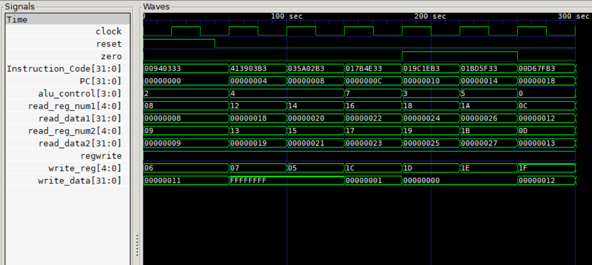

# RISC-V-Processor

<br />
<p align="center">
  <a href="https://riscv.org">
    
  </a>

  <h3 align="center">32-bit RISC-V Processor (Verilog)</h3>

  <p align="center">
    Designed and implemented a modular 32-bit RISC-V processor using Verilog with pipelined architecture.
    <br />
    <a href="https://riscv.org/technical/specifications/"><strong>RISC-V Specifications »</strong></a>
    <br /><br />
  </p>
</p>

---

## Table of Contents

* [About the Project](#about-the-project)
* [Project Structure](#project-structure)
* [Tools Used](#tools-used)
* [Getting Started](#getting-started)

---

## About The Project

This project implements a **32-bit RISC-V processor (RV32I)** using Verilog HDL.  
The design follows a **modular and pipelined architecture**, enabling efficient instruction execution and better throughput.

Key components such as **ALU, Control Unit, Register File, and Memory modules** are designed independently and integrated into a complete processor.

<p align="center">
    
</p>

<p align="center">
    <b>Simulation waveform (GTKWave)</b><br>
    
</p>

---

## Project Structure

* Each module is implemented separately for better scalability and debugging  
* Every module contains its own **testbench and waveform outputs**  
* The final integrated processor is available in the `Processor/` directory  

Main folders:

- ALU  
- Control Unit  
- Register File  
- Memory  
- Processor (Top Module)  
- Testbench  

---

## Tools Used

### iVerilog  
Open-source Verilog simulator used for compiling and running the design.

### GTKWave  
Used for waveform visualization and debugging signal behavior.

---

## Getting Started

### 1. Initialize Instruction Memory  
Load instructions into memory before simulation (default instructions included).

### 2. Initialize Registers  
Registers are initialized with default values (register index - 1).

### 3. Compile

```sh
iverilog -o out Processor_tb.v
